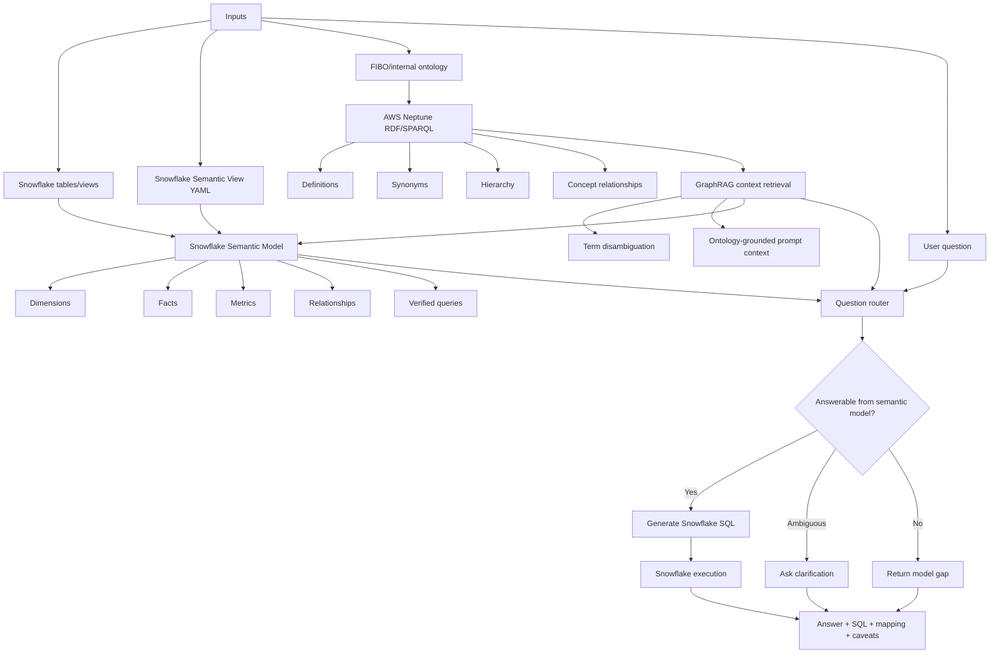

# Neptune + GraphRAG Semantic Model Architecture

## Purpose

Use AWS Neptune as the ontology and GraphRAG layer that enriches Snowflake semantic models with financial meaning. Snowflake remains the governed semantic model and SQL execution layer.

## Architecture

## Inputs

- Snowflake tables/views for holdings, accounts, account groups, instruments, legal entities, trades, exposures, prices, balances, and views.
- Snowflake Semantic View YAML with modeled dimensions, facts, metrics, relationships, filters, and verified queries.
- FIBO RDF/OWL and internal financial vocabulary loaded into Neptune.
- User natural-language questions.

## Processing Flow

1. Resolve terms with Neptune/GraphRAG when the question requires meaning, synonyms, hierarchy, or disambiguation.
2. Map resolved terms to semantic-model fields, metrics, filters, and relationships.
3. Apply guardrails for missing metrics, missing date basis, missing relationship paths, unsupported external data, and bridge-table allocation.
4. Generate Snowflake SQL only from modeled semantics.
5. Execute in Snowflake.
6. Return the metric answer, SQL, semantic mapping, assumptions, and caveats.

## Outputs

- Ontology context summary.
- Semantic mapping summary.
- Snowflake-compatible SQL.
- Metric answer from Snowflake.
- Clarifying question when the request is ambiguous.
- Model-gap response when the semantic model cannot answer.
- Recommendations for semantic model improvements.

## Guardrails

- Neptune is for meaning and disambiguation; Snowflake is for metrics.
- GraphRAG does not compute AUM, exposure, balances, or counts.
- Ontology object properties do not imply physical joins.
- Snowflake SQL must use modeled metrics, dimensions, filters, relationships, and date assumptions.
- Missing semantic-model requirements should block SQL generation.
- Account group and other bridge-table queries must use modeled allocation, effective dating, or distinct logic.

## Example Routing

Question: "What is total AUM by issuer for portfolio groups?"

- Neptune/GraphRAG resolves issuer, AUM, portfolio group, and legal entity terminology.
- Semantic model maps AUM to `positions.total_market_value_usd`.
- Semantic model maps issuer to `instruments.issuer_lei` / `instruments.issuer_name`.
- Semantic model maps portfolio group through account group membership.
- Snowflake SQL computes the answer using holdings/positions and group bridge allocation.

Question: "Is issuer the same as counterparty?"

- Neptune/GraphRAG answers with ontology and semantic-model context.
- Snowflake SQL is not required unless the user asks for a metric.

Question: "What is exposure to entities related to this parent organization?"

- Neptune can resolve legal entity hierarchy or related entities.
- If those related entities are materialized or filterable in Snowflake, generate SQL.
- If not, return a model gap and recommend materializing the entity set into Snowflake.

